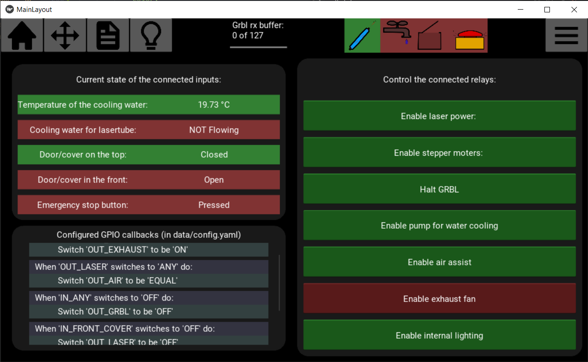

# Laserinterface

**The only touch interface for lasercutters that implements the GPIO functionalities of an embedded Raspberry Pi.**

LaserInterface was created with the goal of a **touchscreen controlled** laser cutter that does not require an external PC. You simply plug a USB drive into the machine, use the touchscreen to set an origin, and fire away. Now, there are already a ton of gcode senders, a lot of which also run on a raspberry pi, but none of them use the GPIO to automate actions and check the safety of the machine.

Controlling GPIO is not the only thing LaserInterface can do. You can select jobs and see a preview of the path, size, and duration. You can jog the machine around to set working offsets and fire test-pulses. And you can control jobs, set them to repeat, and override power and speed values

Controlling the GPIO works by having a relay board connected to the GPIO as an output; and a thermometer, switches, and sensors for the inputs. Of course you can control them manually, but you can also **configure automated actions**. Like pausing grbl when the laser tube gets too hot or if a door is opened; or bind the power of the air assist and the laser so it only makes noise during a job.

## Screenshots

| Start/monitor/control jobs        | Jog the machine                    |
|  |  |
| Select and preview a job          | control and monitor GPIO           |
|   |   |

## Installing LaserInterface

A fully pre-configured image for the raspberry pi is planned, but has not yet been released. For now you will have to download the source code, run `install.sh` to setup the environment, and configure `start.sh` to be run at startup.

## Configuring LaserInterface

Changing the settings can be done by modifying `data/config.yaml`. In there you can configure the GPIO pins, names, and callbacks; the different poll frequencies; and the path for the gcode directory. Read the comments in the file for better explanations.

## Starting LaserInterface

For the best embedded experience, LaserInterface should start at bootup. Starting LaserInterface manually can be done using `start.sh` or by running LaserInterface as a python module: `python -m laserinterface`.

## Further development

Short term improvements:

- [ ] Set up a list of command for a raspberry pi (start at boot, mount usb in gcode folder)
- [ ] Release a completely set up image for the raspberry pi
- [ ] Add Settings menu to change the config.yaml file
- [ ] Add callbacks for starting/stopping a job
- [ ] Fix the virtual keyboard
- [ ] Make gpiodisplay more dynamic to work with the config values

Planned features:

- [ ] Support for reading SVG and converting to gcode
- [ ] Support for reading png/jpg and converting to engrave job
- [ ] Implement boxes.py for integrated boxes creation

### Reusing part of the software

The code is split up over modules that share datamanagers to pass data. It should be fairly easy to reuse only a single submodule in your code but most ui elements do depend on the helpers and datamanagers modules. So if you are getting errors while running individual modules, this should be the first place to look.
